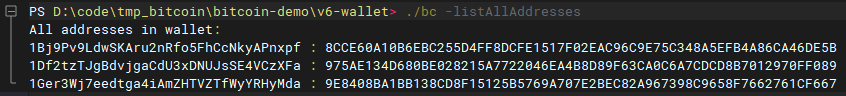

# bitecoin demo

> 学习笔记 \
> 视频 [https://www.bilibili.com/video/BV1EY4y1c7Yq](https://www.bilibili.com/video/BV1EY4y1c7Yq) \
> 配套代码 [https://github.com/dukedaily/go-bitcoin-demo](https://github.com/dukedaily/go-bitcoin-demo)

一个没有网络功能的单机比特币，实现了：

* 生成链式区块
* 实现 POW
* 使用嵌入式数据库 bolt 实现持久化
* 使用bitcoin的算法生成钱包
* 对交易使用钱包中的密钥进行签名和验证

## 使用

```sh
./bc -h
```


```sh
./bc -create 1Bj9Pv9LdwSKAru2nRfo5FhCcNkyAPnxpf genesis-info
```


```sh
./bc -send 1Bj9Pv9LdwSKAru2nRfo5FhCcNkyAPnxpf 1Df2tzTJgBdvjgaCdU3xDNUJsSE4VCzXFa 1 1Df2tzTJgB
dvjgaCdU3xDNUJsSE4VCzXFa second-transfer
```


```sh
./bc -print 20
```


```sh
./bc -getbalance 1Bj9Pv9LdwSKAru2nRfo5FhCcNkyAPnxpf
```


```sh
./bc -listAllAddresses
```


```sh
./bc -createwallet
```
